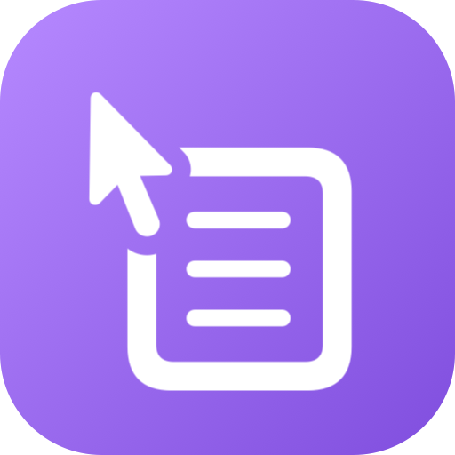
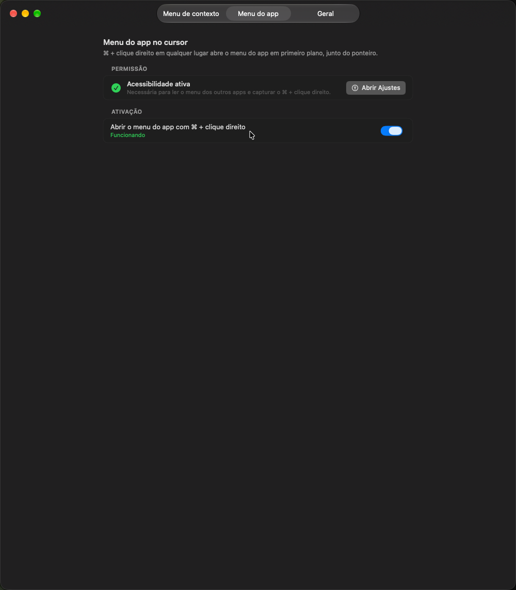

<div align="center">
  

  <h1>iMenuPeek</h1>

  <p><strong>Ações próprias no menu de botão direito do Finder — scripts seus, num submenu só.</strong></p>
  <p>Crie ações em zsh (inline ou em arquivo), escolha quando cada uma aparece e use direto no menu de contexto do Finder. Vem com Copiar caminho, Ocultar / Reexibir, Subir um nível e Novo arquivo — e abre o menu de qualquer app junto do cursor com ⌘ + clique direito.</p>

  <p>
    
    
    
    
  </p>
</div>

---

<p align="center">
  
</p>

---

## 🧭 O problema

O menu de botão direito do Finder não deixa você pendurar comandos seus. Os apps que fazem isso ou são pagos, ou não rodam script próprio, ou são projetos pequenos que ninguém revisou.

## ✨ A solução

O iMenuPeek é um app de barra de menus com uma extensão do Finder. Você cria ações (scripts zsh) e elas aparecem no menu de contexto, todas dentro do submenu **iMenuPeek ▸**. O app executa o script; a extensão só monta o menu.

## 🎯 Features

- **Ações prontas** (já vêm ligadas, no submenu iMenuPeek ▸):
  - **Copiar caminho** — caminho completo dos itens selecionados
  - **Ocultar / Reexibir** — inverte o atributo oculto de cada item (o mesmo do `chflags hidden`); para reexibir, mostre os ocultos com **⌘⇧.** e use a ação no item
  - **Subir um nível** — leva a janela do Finder para a pasta de cima
  - **Novo arquivo** — no espaço vazio da janela, a partir de modelos
- **Ações suas** — script zsh inline ou em arquivo, ou "abrir com app"; recebe os itens em `$1…$n` e `MENUMATE_PATHS`
- **Regras** — arquivos, pastas, espaço vazio, tipo de arquivo, mínimo/máximo de itens
- **Menu do app no cursor** — **⌘ + clique direito** em qualquer lugar abre o menu do app em primeiro plano junto do ponteiro (estilo Menuwhere); liga/desliga em Ajustes › Geral
- **Teste com amostras** e **histórico de execuções** com saída e erro; aviso quando um script falha
- **Menu de contexto completo** — vê e desliga Serviços e extensões de outros apps que poluem o botão direito
- **Ícones acompanham o tema** claro/escuro; interface em **português**, inglês e chinês

## 📦 Instalação

1. Baixe o `iMenuPeek.dmg` na [última release](https://github.com/fredwilliamtjr/iMenuPeek/releases/latest)
2. Arraste o **iMenuPeek.app** para **Aplicativos** e abra
3. Siga as boas-vindas: ative a **extensão do Finder**, conceda **Notificações**, **Automação › Finder** e **Acessibilidade** (para o menu no cursor), e use **Reiniciar o Finder** na última tela

O app tem assinatura ad-hoc (sem notarização da Apple). Se o macOS bloquear dizendo que está "danificado":

```bash
xattr -dr com.apple.quarantine /Applications/iMenuPeek.app
```

## ⚙️ Como usar

- Clique com o botão direito num arquivo, pasta ou espaço vazio → **iMenuPeek ▸**
- **⌘ + clique direito** em qualquer lugar → menu do app em primeiro plano no cursor
- Ícone na barra de menus → **Ajustes** para criar e editar ações e ver o menu completo
- **Execuções recentes** mostra o resultado de cada ação

O menu não aparece em `/Applications`, no iCloud Drive nem em pastas gerenciadas por provedores de arquivo (limitação do Finder para extensões).

## 🔒 Segurança

- Cada clique é **assinado** pela extensão (HMAC-SHA256 com chave por instalação) e o app recusa o que não estiver assinado — outro app não consegue disparar suas ações.
- Pede **Acessibilidade** para o menu no cursor; os scripts das ações, por rodarem pelo app, também passam a ter esse poder — rode só scripts em que você confia.
- Sem Acesso Total ao Disco, sem importação de pacotes da internet, sem atualização automática, sem telemetria.
- Detalhes em [SECURITY.md](SECURITY.md).

## 🔨 Build a partir do código

Requer macOS 13+, Xcode 16+ e Homebrew.

```bash
make build                              # gera o projeto (XcodeGen) e compila em Debug
cd Core && swift test                   # testes do núcleo
zsh scripts/build_release.sh 0.1.0      # versão final: dist/iMenuPeek.dmg e .zip
```

Mais em [docs/RELEASING.md](docs/RELEASING.md).

## 🌱 Origem

Fork do [MenuMate](https://github.com/Hibrielle/menumate), de Hibrielle (MIT), com o histórico preservado. Antes do fork, o código passou por revisão de segurança. Mudanças do iMenuPeek: nome e identidade próprios, cliques autenticados, sem Cut/Paste, sem Sparkle, sem importação de pacotes, tudo no submenu do app, ícones conforme o tema, ação Ocultar / Reexibir, menu do app no cursor (leitura de menus adaptada do [menuanywhere](https://github.com/acsandmann/menuanywhere), MIT — ver [THIRD-PARTY-NOTICES.md](THIRD-PARTY-NOTICES.md)) e interface em português. Por compatibilidade com pacotes do MenuMate, ficam o módulo `MenuMateCore`, as variáveis `MENUMATE_*`, a ponte `window.menumate` e o tópico `menumate-pack`. Documentação original em [docs/README-menumate.md](docs/README-menumate.md).

## 👨‍👩‍👧 Família Peek

iMenuPeek faz parte da família **Peek** — utilitários de barra de menu para o macOS:

- [**iCloudPeek**](https://github.com/fredwilliamtjr/iCloudPeek) — o que o iCloud Drive está subindo/baixando em tempo real
- [**iNetPeek**](https://github.com/fredwilliamtjr/iNetPeek) — failover automático entre Ethernet e Wi-Fi
- [**iMackPeek**](https://github.com/fredwilliamtjr/iMackPeek) — leva as configurações do Finder entre seus Macs
- [**iRemoteAiPeek**](https://github.com/fredwilliamtjr/iRemoteAiPeek) — mantém o Remote Control do Claude Code sempre ligado
- [**iSyncAiPeek**](https://github.com/fredwilliamtjr/iSyncAiPeek) — leva o que suas IAs aprenderam entre seus Macs
- **iMenuPeek** — ações próprias no menu de botão direito do Finder

## 📄 Licença

MIT — ver [LICENSE](LICENSE). Copyright (c) 2026 Hibrielle (código original do MenuMate).

---

<div align="center">
  <sub>Feito com ☕ por <a href="https://github.com/fredwilliamtjr">@fredwilliamtjr</a></sub>
</div>
